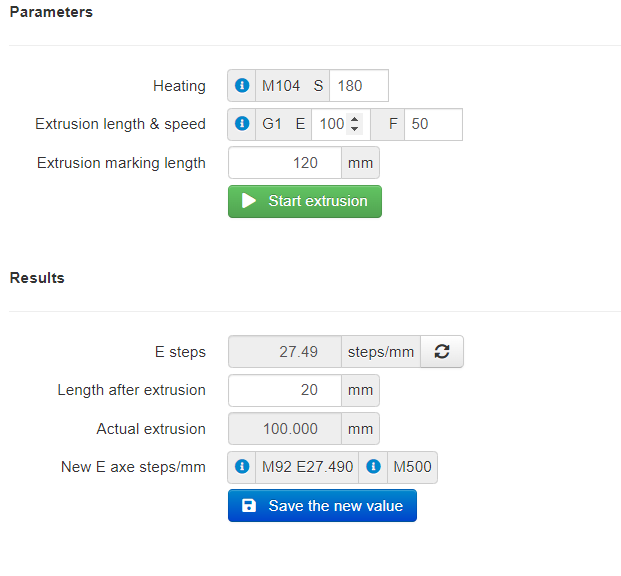
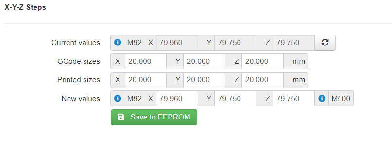
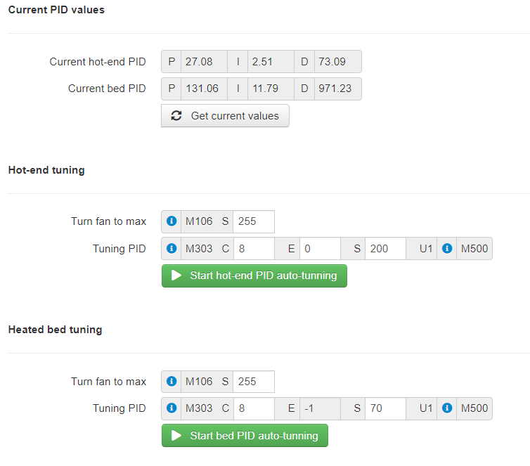

# OctoPrint-CalibrationTools

A set of tools to help users with calibration process.
Supported tunings:

- E Steps - calibrating number of steps/mm for E extruder;
- XYZ Steps - calibrating number of steps/mm for axes X, Y and Z;
- PID Auto-tune - calibration Proportional gain, Integral gain and Derivative values for hot-end and heated bed;

Before start using this plugin I strongly recommend reading some documentation about tunning [teachingtechyt.github.io](https://teachingtechyt.github.io/calibration.html)

## Supported frameworks

- Marlin 2.x

## Screens

## Setup

Install via the bundled [Plugin Manager](https://docs.octoprint.org/en/master/bundledplugins/pluginmanager.html)
or manually using this URL:

    https://github.com/SergiuToporjinschi/OctoPrint-CalibrationTools/archive/main.zip

## Configuration

You can set the default values for each tuning process.
